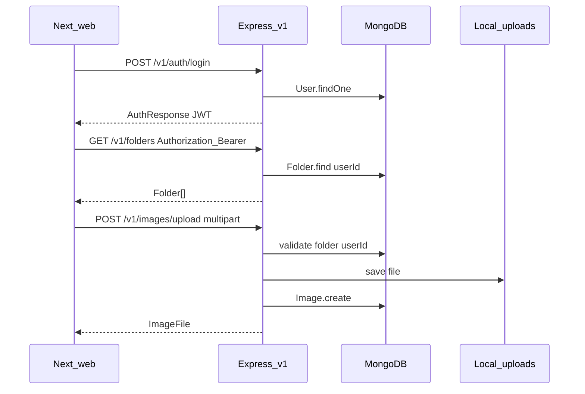

# Google Drive–like app: implementation plan

## Current baseline (repo reality)

- **API prefix**: [`apps/server/src/app.ts`](apps/server/src/app.ts) mounts routes at **`/v1`** (plan all new routes as `/v1/auth/...`, `/v1/folders`, etc., or nest under a single `api` router—pick one convention and keep it consistent).
- **Server entry**: [`apps/server/src/main.ts`](apps/server/src/main.ts) (your spec says `server.ts`; either **rename** to match the spec or **keep `main.ts`** and treat it as `server.ts`—also fix [`apps/server/package.json`](apps/server/package.json) `start` script if it does not match compiled output: today it says `node dist/main.js` while `build` runs `tsc` with `outDir: dist`).
- **Dependencies**: [`apps/server/package.json`](apps/server/package.json) already includes **mongoose, bcrypt, jsonwebtoken, multer, zod, cors**—no need to re-spec them unless versions drift.
- **Web**: Next App Router under [`apps/web/src/app`](apps/web/src/app), **axios** present, [`@monorepo/ui`](packages/ui) available for polished forms/dialogs.
- **Shared types**: [`packages/types`](packages/types) currently only exports [`simple-api-client`](packages/types/src/api/simple-api-client.ts); you will replace/extend exports with domain types + API DTOs.

---

## Architecture (end-to-end)

**Access control rule (non-negotiable)**: every DB query for folders/images includes `userId` from JWT; every “load by id” path verifies the document’s `userId` matches before returning or mutating.

---

## Step 0 — Shared contracts (`packages/types`)

Add the files you listed and export them from [`packages/types/src/index.ts`](packages/types/src/index.ts):

- [`packages/types/src/user.ts`](packages/types/src/user.ts): `User` (DTO shape with `_id` as string for JSON; optionally add a `UserDocument` note in comments if you keep Mongoose ObjectIds internal).
- [`packages/types/src/folder.ts`](packages/types/src/folder.ts): `Folder`, `FolderNode`.
- [`packages/types/src/image.ts`](packages/types/src/image.ts): `ImageFile`.
- [`packages/types/src/api.ts`](packages/types/src/api.ts): `AuthResponse`, request/response types for signup/login, folder create/list, upload response, and any **GET images** listing type (see below—your spec lists upload only, but the dashboard needs a read endpoint).

**Convention**: API returns ISO strings for dates; map in services with `.toISOString()` so the web app matches your `createdAt: string` types.

Also decide whether [`packages/types/src/api/simple-api-client.ts`](packages/types/src/api/simple-api-client.ts) remains; likely **remove or repurpose** once real endpoints exist.

---

## Step 1 — MongoDB connection (`apps/server`)

Create [`apps/server/src/config/db.ts`](apps/server/src/config/db.ts):

- Read `MONGODB_URI` (and optional `DB_NAME`) from `process.env` via `dotenv/config` loaded once at startup ([`apps/server/src/main.ts`](apps/server/src/main.ts)).
- `mongoose.connect` with sensible options; log success/failure; **fail fast** in production if missing URI.

Wire connection **before** `http.createServer` listens (await init in `main.ts`).

---

## Step 2 — Auth backend (JWT + bcrypt)

### Models

- [`apps/server/src/models/user.model.ts`](apps/server/src/models/user.model.ts): `email` (unique index), `passwordHash`, timestamps; do **not** return password fields from controllers.

### Services / controllers / routes

- [`apps/server/src/services/auth.service.ts`](apps/server/src/services/auth.service.ts): signup (hash with bcrypt), login (compare), token issuance (JWT) returning `AuthResponse` shape from `@monorepo/types`.
- [`apps/server/src/controllers/auth.controller.ts`](apps/server/src/controllers/auth.controller.ts): parse/validate body (zod), map errors to HTTP (400/401/409).
- [`apps/server/src/routes/auth.routes.ts`](apps/server/src/routes/auth.routes.ts):
  - `POST /auth/signup`
  - `POST /auth/login`

Mount under `/v1` in [`apps/server/src/routes/index.ts`](apps/server/src/routes/index.ts).

### Middleware

- [`apps/server/src/middleware/auth.middleware.ts`](apps/server/src/middleware/auth.middleware.ts): read `Authorization: Bearer <token>`, verify JWT, attach `req.userId` (extend Express `Request` typing via a small `types/express.d.ts` or inline module augmentation).

**JWT payload**: at minimum `{ sub: userId }` (or `userId` field—just be consistent between sign and verify).

---

## Step 3 — Auth frontend (App Router + localStorage)

Create route groups/pages:

- [`apps/web/src/app/(auth)/login/page.tsx`](<apps/web/src/app/(auth)/login/page.tsx>)
- [`apps/web/src/app/(auth)/signup/page.tsx`](<apps/web/src/app/(auth)/signup/page.tsx>)

Implementation notes:

- Mark pages **`"use client"`** as requested; forms call backend `POST /v1/auth/*`.
- On success: persist token (and optionally user JSON) in **localStorage**; redirect to **`/dashboard`**.
- Add [`apps/web/src/lib/auth.ts`](apps/web/src/lib/auth.ts): `getToken`, `setToken`, `clearToken`, `isAuthed` helpers.
- Add [`apps/web/src/store/auth.store.ts`](apps/web/src/store/auth.store.ts): minimal client store (could be React context + `useState` if you want zero extra deps; otherwise a tiny zustand install—only if you want it; your spec names a store file).

API layer (Step 7 can start here, but minimally needed for Step 3):

- [`apps/web/src/lib/api.ts`](apps/web/src/lib/api.ts): axios instance with `baseURL` from `process.env.NEXT_PUBLIC_API_BASE_URL` (must include `/v1` or bake `/v1` into paths consistently).
- Request interceptor: attach `Authorization` header when token exists.
- Response interceptor: centralize 401 handling (clear token + redirect to `/login`).

Thin service modules:

- [`apps/web/src/services/auth.api.ts`](apps/web/src/services/auth.api.ts)

Hook:

- [`apps/web/src/hooks/useAuth.ts`](apps/web/src/hooks/useAuth.ts): read token/user from localStorage on mount, expose login/logout.

**CORS**: already allows `http://localhost:3000` in [`apps/server/src/app.ts`](apps/server/src/app.ts); keep aligned with Next dev origin.

---

## Step 4 — Folder system (backend + tree UI)

### Backend

- [`apps/server/src/models/folder.model.ts`](apps/server/src/models/folder.model.ts): `name`, `userId`, `parentId` (ObjectId ref or string+manual validation), timestamps.
- [`apps/server/src/services/folder.service.ts`](apps/server/src/services/folder.service.ts):
  - `createFolder(userId, { name, parentId })`: if `parentId` set, verify parent folder exists **and** `parent.userId === userId`.
  - `listFolders(userId)`: return all folders for user (flat list is enough for client tree building).
- [`apps/server/src/controllers/folder.controller.ts`](apps/server/src/controllers/folder.controller.ts)
- [`apps/server/src/routes/folder.routes.ts`](apps/server/src/routes/folder.routes.ts): protect with `authMiddleware`
  - `POST /folders`
  - `GET /folders`

### Frontend

- [`apps/web/src/services/folder.api.ts`](apps/web/src/services/folder.api.ts)
- [`apps/web/src/hooks/useFolders.ts`](apps/web/src/hooks/useFolders.ts): fetch + optimistic create optional later
- [`apps/web/src/components/FolderTree.tsx`](apps/web/src/components/FolderTree.tsx): build `parentId -> children[]` map in memory, render recursively, expose `selectedFolderId` via props/callback.

---

## Step 5 — Image upload (multer + local storage + read API)

### Backend

- [`apps/server/src/middleware/upload.middleware.ts`](apps/server/src/middleware/upload.middleware.ts): multer `diskStorage` to `apps/server/uploads/` (gitignore this directory), unique filenames (uuid + ext), **MIME/size limits** (images only).
- [`apps/server/src/models/image.model.ts`](apps/server/src/models/image.model.ts): `name`, `url` (public path like `/uploads/...`), `size`, `folderId`, `userId`.
- [`apps/server/src/services/image.service.ts`](apps/server/src/services/image.service.ts):
  - validate `folderId` belongs to `userId`
  - create DB record after file write
- [`apps/server/src/controllers/image.controller.ts`](apps/server/src/controllers/image.controller.ts)
- [`apps/server/src/routes/image.routes.ts`](apps/server/src/routes/image.routes.ts):
  - `POST /images/upload` (fields: `name`, `image` file, `folderId`)

**Static serving**: in [`apps/server/src/app.ts`](apps/server/src/app.ts), `app.use("/uploads", express.static(...))` pointing at the uploads directory (ensure this is **not** under `/v1` so URLs stored in DB are stable).

**Required companion endpoint (dashboard)**: add something like:

- `GET /images?folderId=...` **or** `GET /folders/:folderId/images`

Also protected by JWT and **folder ownership check**.

### Frontend

- [`apps/web/src/services/image.api.ts`](apps/web/src/services/image.api.ts): `FormData` upload using axios (`multipart/form-data`, no manual `Content-Type` header).
- [`apps/web/src/components/UploadModal.tsx`](apps/web/src/components/UploadModal.tsx): dialog + file input + optional name defaulting to filename.
- [`apps/web/src/components/FileCard.tsx`](apps/web/src/components/FileCard.tsx): show thumbnail/preview using returned `url` (absolute URL may require joining API host + path).

---

## Step 6 — Folder size calculation (optimized batch + DFS)

Implement [`apps/server/src/utils/calculateFolderSize.ts`](apps/server/src/utils/calculateFolderSize.ts):

**Inputs**: arrays of `Folder` edges (`_id`, `parentId`) and `ImageFile` rows (`folderId`, `size`) for a single `userId` (already filtered in service).

**Algorithm**:

1. Build `folderId -> childFolderIds[]`
2. Build `folderId -> directImageBytes`
3. DFS/post-order from each node to compute subtree totals: `total[folder] = directImages + sum(total[child])`
4. Return `Record<string, number>` (or `Map<string, number>`)

Expose sizes to UI in one of these ways (pick one):

- **A (simplest)**: extend `GET /folders` response to include `{ folders, sizesByFolderId }`
- **B**: new `GET /folders/tree` returning `FolderNode[]` with `children`, `images`, `totalSize` precomputed server-side

Your `FolderNode` type fits **B**; **A** keeps payloads smaller if the tree is built client-side.

---

## Step 7 — Dashboard UI + wire-up

- [`apps/web/src/app/dashboard/page.tsx`](apps/web/src/app/dashboard/page.tsx): `"use client"` or split layout: protect route by checking token (redirect to `/login` if missing).
- Layout:
  - **Left**: `FolderTree` + “Create folder” (prompt/modal) for `parentId = selected ?? null`
  - **Right**: grid/list of `FileCard` for current folder + `UploadModal`
- Use `@monorepo/ui` primitives (`Button`, `Input`, `Dialog`, `Card`) for consistent styling.

---

## Step 8 — “Connect everything” checklist

- **Env templates** (do not commit secrets): server `.env` with `MONGODB_URI`, `JWT_SECRET`, `PORT`; web `.env.local` with `NEXT_PUBLIC_API_BASE_URL`.
- **Types drift guard**: import DTO types from `@monorepo/types` in both apps where practical.
- **Error model**: consistent JSON error shape `{ message, code? }` for axios interceptor parsing.
- **Indexes**: Mongo indexes on `Folder(userId, parentId)`, `Image(userId, folderId)`, `User(email)`.

---

## Bonus backlog (after MVP)

- Drag-and-drop upload, breadcrumbs, cached sizes (React Query/SWR), optimistic creates/uploads.

---

## Key files you will touch most

- Server wiring: [`apps/server/src/app.ts`](apps/server/src/app.ts), [`apps/server/src/routes/index.ts`](apps/server/src/routes/index.ts), [`apps/server/src/main.ts`](apps/server/src/main.ts)
- Types entry: [`packages/types/src/index.ts`](packages/types/src/index.ts)
- Web API glue: [`apps/web/src/lib/api.ts`](apps/web/src/lib/api.ts)
